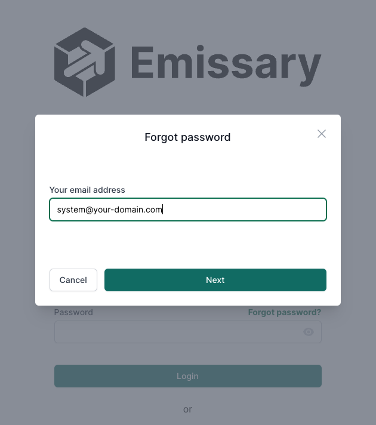
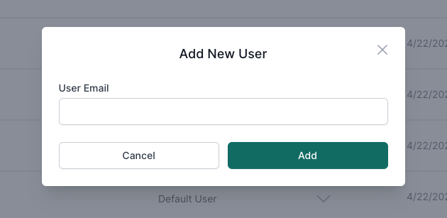
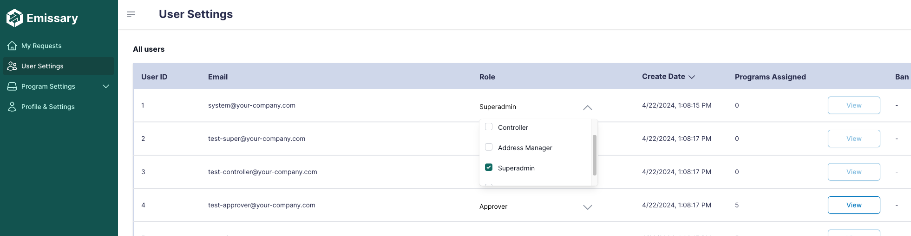
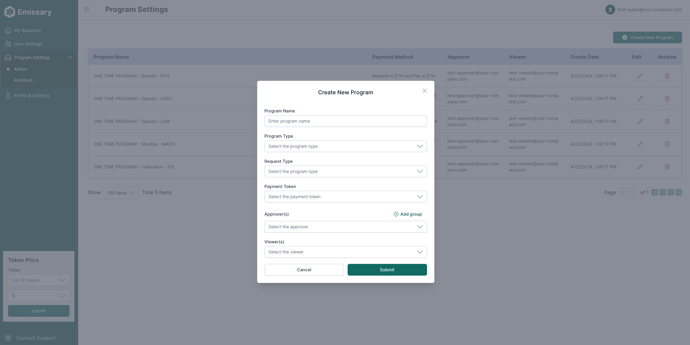

# Admin

## Table of Contents
- [Admin](#admin)
  - [Table of Contents](#table-of-contents)
  - [Overview](#overview)
  - [Log in for the first time](#log-in-for-the-first-time)
  - [Inviting users to the platform](#inviting-users-to-the-platform)
  - [Defining the user roles](#defining-the-user-roles)
  - [Creating programs](#creating-programs)

## Overview

This guide is your go-to resource for getting started with our system. As an administrator, you'll find step-by-step instructions on key actions to kickstart your experience. We've got you covered from the initial login to managing users and roles and creating programs.

## Log in for the first time

After the system is all set, you can start using it with the system account. To do it, follow the steps:

1. On the login page, click "Forgot Password."
2. Enter the system email defined during application setup in the modal that appears.
3. Check your system email for a message with instructions to define a new password.
4. Click the link in the email to set your new password.

<code>ℹ️ The domain of the system user is configured by the person who has set up the application. The email always starts with "system”. If you want to change it, ask the person who has set up the application</code>

Congratulations! You can now log in using your system email and the newly defined password.

## Inviting users to the platform

Users can start using the platform in different ways. One of them is being invited by a system admin. Here's how you can invite users:

1. Log in with the system account.
2. In the sidebar, navigate to "User Settings."
3. You will see the list of registered users on the User Settings page. Click "Add New User" at the top right.
4. Enter the user's email and submit.

After adding the user, they'll appear in the "All Users" table. An invitation email will be sent to them, containing a link to complete their account setup.

## Defining the user roles

Emissary provides distinct roles for specific functions, such as Approvers for reviewing transfer requests and Controllers for processing payments. The Super Admin role is the only one with the authority to assign new roles.

<code>ℹ️ [Click here to see more information about Roles and Responsibilities.](../guide/roles-and-responsibilities.md)</code>

To assign roles to the users, follow the steps:

1. Log in with the system account that was set up before;
2. On the sidebar, go to “User Settings”;
3. On the All Users table, you can click on the Role column for the user you want to add or remove a role.

Assigning roles grants users access to role-specific features.

<code>ℹ️ To use the system and pass through all the steps of a transfer request, having at least one Approver and one Controller is essential.</code>

<code>ℹ️ We highly recommend you invite/create a new account to be used as a super admin instead of using the system account.</code>

## Creating programs

Programs on Emissary are essential when creating a new transfer, as they contain vital information such as the Payment Token, Approvers, and others.

To create a new program, follow the steps:

1. Log in with the system account or any account with a Super Admin role.
2. Navigate to the "Active" section under "Program Settings" in the sidebar.
3. Click "Create New Program" on the Program Settings page.
4. Fill in the requested information.
5. Click "Submit” to create the program.

Once created, your program will appear in the list, ready for use in new transfer requests.

You can also edit or archive a program on the program name in the list.

<code>ℹ️ [Click here to see more information about Programs.](../guide/programs.md)</code>
