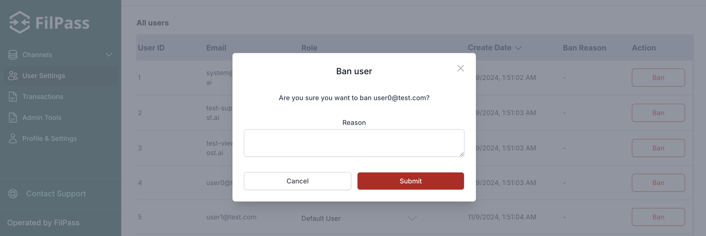

# Admin

## Table of Contents

- [Admin](#admin)
  - [Table of Contents](#table-of-contents)
  - [Overview](#overview)
  - [Log in for the first time](#log-in-for-the-first-time)
  - [Defining the user roles](#defining-the-user-roles)
  - [Ban a user](#ban-a-user)
  - [Submit ticket transactions](#submit-ticket-transactions)

## Overview

This guide is your go-to resource for getting started with our system. As an administrator, you'll find step-by-step instructions on key actions to kickstart your experience. We've got you covered from the initial login to managing users and roles.

## Log in for the first time

After the system is all set, you can start using it with the system account. To do it, follow the steps:

1. On the login page, click "Forgot Password."
2. Enter the system email defined during application setup in the modal that appears.
3. Check your system email for a message with instructions to define a new password.
4. Click the link in the email to set your new password.

<code>ℹ️ The domain of the system user is configured by the person who has set up the application. The email always starts with "system”. If you want to change it, ask the person who has set up the application</code>

Congratulations! You can now log in using your system email and the newly defined password.

## Defining the user roles

FilPass provides distinct roles for specific functions, The Super Admin role is the only one with the authority to assign new roles.

To assign roles to the users, follow the steps:

1. Log in with the system account that was set up before;
2. On the sidebar, go to “User Settings”;
3. On the All Users table, you can click on the Role column for the user you want to add or remove a role.

Assigning roles grants users access to role-specific features.

<code>ℹ️ We highly recommend you invite/create a new account to be used as a super admin instead of using the system account.</code>

## Ban a user

Users can be banned to prevent them from accessing the system. To ban a user, follow these steps:

1. Log in with an account that has Super Admin privileges;
2. On the sidebar, navigate to "User Settings";
3. In the All Users table, locate the user you want to ban;
4. At the end of the user's row, click the "Ban" button.
5. A modal will appear, asking you to add a reason for the ban. Add the reason and click "Submit".

Banning a user immediately prevents them from accessing the system. They will be automatically logged out if they're currently active.

<code>ℹ️ Banned users can be unbanned at any time by following the same steps and selecting "Unban".</code>

## Submit ticket transactions

As a Super Admin, you can monitor all ticket submission transactions in the system. This feature helps you track and verify the status of blockchain transactions associated with ticket submissions and take appropriate actions.

To view ticket transactions:

1. Log in with an account that has Super Admin privileges;
2. On the sidebar, navigate to "Transactions";
3. You'll see a table displaying all ticket submission transactions with the following information:
   - Creation Date
   - Receiver Address
   - Contract Address
   - Status
   - Block Explorer Link

The Block Explorer link allows you to verify the transaction details directly on the blockchain. Click the link to open the transaction in your blockchain explorer.

<code>ℹ️ Failed transactions have their status highlighted in red for easy identification.<code>