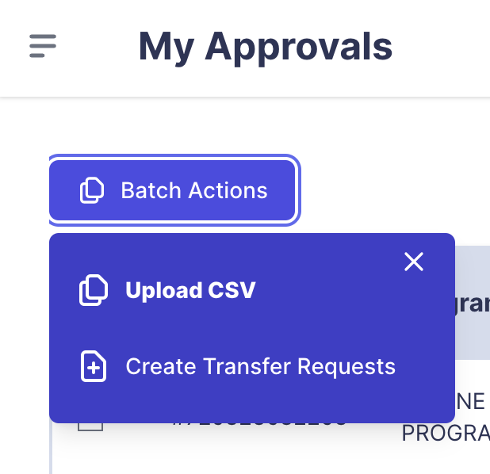
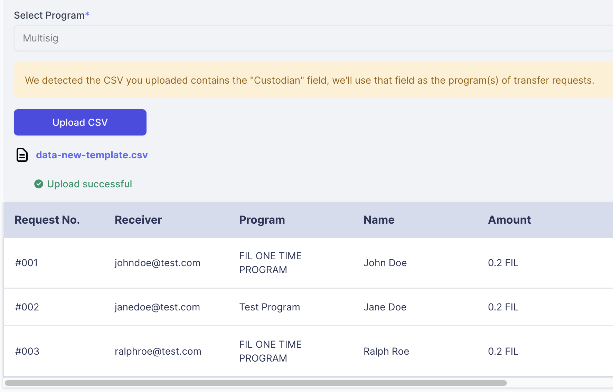
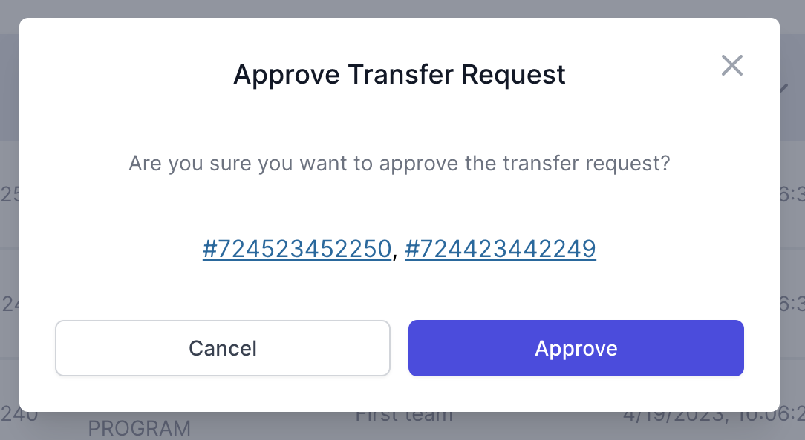

# Approver

## Table of Contents
- [Approver](#approver)
  - [Table of Contents](#table-of-contents)
  - [Overview](#overview)
  - [Creating Transfer Requests](#creating-transfer-requests)
    - [Uploading requests via CSV](#uploading-requests-via-csv)
      - [Alternate CSV template](#alternate-csv-template)
    - [Create Transfer Requests in batch](#create-transfer-requests-in-batch)
  - [Reviewing Transfer Requests](#reviewing-transfer-requests)
      - [Review Transfer Requests in Batch](#review-transfer-requests-in-batch)
      - [Withdraw a review](#withdraw-a-review)

## Overview

This guide is your go-to resource for getting started with our system. As an approver, you'll find step-by-step instructions on key actions to kickstart your experience. We've got you covered, from creating transfer requests in batch to reviewing the transfer requests.

## Creating Transfer Requests

There are two ways to create transfer requests. Both users and approvers can create transfer requests under a program. As an approver, sometimes you may want to create a transfer request for receivers if you already have all the information. You can use the following guide to create transfer requests (in batch) without having receivers create them.

### Uploading requests via CSV

If you want to create multiple requests at once or assign a request vesting information, you can create requests via CSV following the steps: From any page under the “My Approvals” section, click the “Batch Actions” button and then click on “Upload CSV”. Select the “Download CSV template” button to receive the format for bulk upload requests.

1. Log in with your account;
2. Navigate to the "My Approvals" section;
3. Click on the “Batch Actions” button and then click on “Upload CSV”;



4. Click on the “Download CSV template” button to receive the format for bulk upload requests;
5. Fill the CSV with the following information:

The downloaded template will have the following fields:

- **Email**: Add existing and new receivers’ email addresses.
- **Name**: Add the name of the project/team.
- **Wallet Address**: Add the wallet address for the receiver in the same row.
    - If you add a new user, this field is required and will become a default wallet address.
    - The system will check for a default wallet address if this field is left blank. If none exists for this user, the system will return an error.
- **Amount**: Add the amount based on the token of the selected program.
- **Should Receiver Review:** Add `true`, `yes`, or `1` if you want the user to review the transfer request creating as a “Draft”. Otherwise, leave it blank or set it to `false`, `no`, or `0` to create a “Submitted” status.

6. When done adding to the template, export the file as CSV;
7. Select the program to which you wish to add the requests;
8. Upload the CSV by clicking on "Submit All";
9. The transfer requests will appear on a table where you can review it;
10. If everything is correct, click the “Submit All” button to create the transfer requests.

#### Alternate CSV template

An alternate CSV template can be uploaded to the Emissary. The main difference of this template is the “Custodian” field. The custodian field represents the program for the transfer request being created. This allows the CSV file to have a different program for each transfer request instead of one for all.

The template must have the following fields:

```
Name, Email, Amount, Custodian, Addresses, ApprovalForTransfer
```

The **ApprovalForTransfer** field must always have a value of `true`.

The **Addresses** field should contain only one address.

Sample of a CSV file using the alternate template with three transfer requests:

```
Name,Email,Amount,Custodian,Addresses,ApprovalForTransfer
John Doe,johndoe@test.com,0.2,ONE TIME PROGRAM - FIL,0xe1d4a6d35d980ef93cc3be03c543edec2948c3d1,true
Jane Doe,janedoe@test.com,0.2,Test Program,0xe1d4a6d35d980ef93cc3be03c543edec2948c3d1,true
Ralph Roe,ralphroe@test.com,0.2,ONE TIME PROGRAM - FIL,0xe1d4a6d35d980ef93cc3be03c543edec2948c3d1,true
```

After uploading the CSV file, the app disables the Select Program field and shows the following warning text explaining the reason.



From the screenshot above, we can notice that Request numbers 1 and 2 have different Programs.

### Create Transfer Requests in batch

You can add up to ten requests at a time on this page. By default, requests will be created in Submitted status unless “Ask the receivers to review and submit the requests” is selected.

## Reviewing Transfer Requests

As an approver, one of the most important tasks is to review the transfer requests that have set a program where you are one of the reviewers, this ensures that the transfer requests meet all the requirements.

To check the transfer requests that need review and to review them, follow the steps:

1. Log in with your account;
2. Navigate to the "Pending You” under the "My Approvals" section;
3. You will see a list of all transfer requests pending your review;
4. Click on a transfer request row to be redirected to the transfer request detail page;

You can perform four actions for each request: Requires Change, Reject, Approve, Delete(only if you created the request).

    - Approve: if everything looks correct
    - Reject: if you would like to reject the request, e.g. it is wrong submitted to the program, duplicate request, etc. You can enter the reason for rejection.
    - Requires Change: if you would like the user to change the information and resubmit, e.g. wrong amount or name. You can enter the reason to require change.
    - Delete: if you create a transfer request for the wrong person.

5. Click on the action that you want to perform;
6. Confirm the action.



</br><code>
🚨 It’s extremely important to review all the transfer requests carefully, and make sure that the right person is being paid.
</code>

#### Review Transfer Requests in Batch

If you are really certain that a list of transfer request is correct you have the option to review them in batch. Approving transfer requests in batch is discouraged and we encourage you to click into each one to make sure that you carefully review their details before making a decision.

Follow the steps to review a list of transfer requests in batch:

1. Log in with your account;
2. Navigate to the "Pending You” under the "My Approvals" section;
3. You will see a list of all transfer requests pending your review;
4. Select multiple requests by checking the checkbox at the left of each item;
5. Click on the action that you want to preform at the top left of the page;
6. Confirm the action you want and the transfer request numbers.

#### Withdraw a review

If an approver unintentionally approves or rejects a transfer request, they have the option to withdraw their actions. To do this, they can click on the transfer request and select the “Withdraw Action” button, which will return the transfer request to its previous status. For example, if the approver is the only person in charge of approving a transfer request on a program and they accidentally approve a transfer request, they can withdraw their approval and the transfer request will return to the “Submitted” status.
