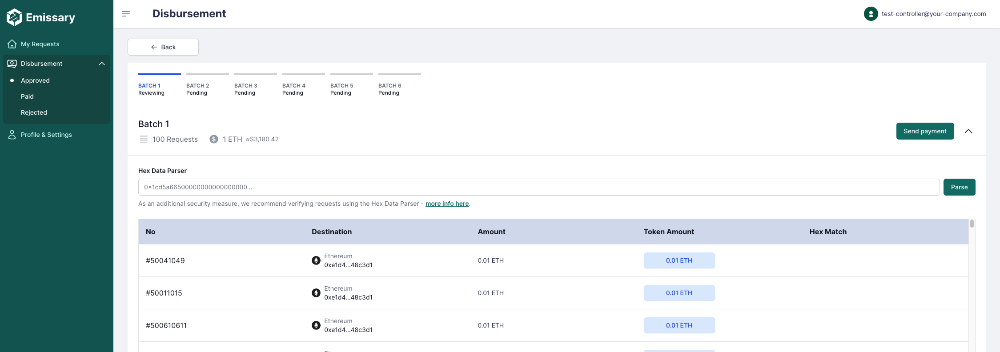
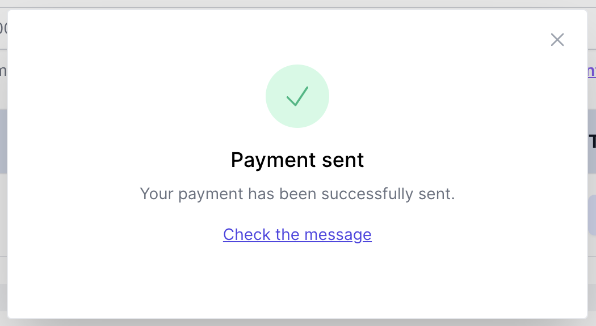

# Controller

## Table of Contents
- [Controller](#controller)
  - [Table of Contents](#table-of-contents)
  - [Overview](#overview)
  - [Paying Transfer Requests](#paying-transfer-requests)

## Overview

This guide is your go-to resource for getting started with our system. As a controller, you'll find step-by-step instructions on key actions to kickstart your experience. We've got you covered on paying transfer requests.

## Paying Transfer Requests

To begin, ensure that you have MetaMask installed on your device and logged in with your controller account.

<code>ℹ️  If you need assistance with installing and connecting your wallet with MetaMask, refer to the [Connecting a wallet](../guide/connecting-a-wallet.md).</code>

To initiate the payment process, follow these steps:

1. Log in with your account;
2. Navigate to the "Approved" under the "Disbursement" section;
3. Choose the Transfer Requests you wish to pay. You can select one or multiple Transfer Requests.

<code> ℹ️  To pay multiple transfer requests you need to select only one blockchain/network. You can [Filter](../guide/filtering-transfer-requests.md) and select a blockchain to facilitate the process.</code>

4. Click on the "Pay" button located under the Disbursement page title. You will be redirected to the payment page.
5. On the payment page, you will find the following important information:

- A stepper displaying a list of Transfer Request batches. You can click on the stepper to navigate between different steps.
- The total payout amount for all batches, displayed in the transfer requests token and its corresponding value in dollars.
- Details of the selected batch, including the batch number, number of Transfer Requests, total token amount, and total dollar amount.
- By clicking the dropdown button next to the “Send payment” button, you can access additional information about the selected batch. This includes a table listing the Transfer Requests being paid within that batch, along with their `public IDs, destinations, amounts, token amount, and the hex match` (a security functionality discussed in the next section).

6. Click on the "Send Payment" button.
  -  6.1. If you are paying requests that are using custom tokens (ERC20) such as USDC, a extra step will be displayed to approve the amount to be paid. 
7. A MetaMask pop-up or page will open, displaying payment information such as the total amount of tokens and the gas fee (transaction fee).

<code>
🚨 Important Actions before Confirming the payment

Before confirming the payment, ensure the following:

1. Verify that the payment amount matches the total amount of tokens for the selected batch.
2. Switch to the "Hex" tab within the MetaMask pop-up and navigate to the bottom. Click on "Copy raw transaction data."
3. On Emissary, paste the copied hex data into the "Hex Data Parser" field and click on the "Parse" button.
4. The system will validate whether the payment information on MetaMask matches the information on Emissary. The result will be displayed in an alert above the "Hex Data Parser" field and on the Transfer Request table.

If all hex data match **successfully**, you can proceed with the payment confirmation in MetaMask continuing the following steps.
If the at least one hex data **do not match**, do not continue with the payment.

</code>

8. Confirm the payment in MetaMask.
9. If the payment is successful, a modal will appear, confirming the payment for the batch. The modal will contain a link to the blockchain explorer, allowing you to view transaction details. If multiple steps are involved (when you are paying more the 100 requests), the selected step will be highlighted in green and you can you go to the next one.

Please note that payments may take several minutes to be processed depending on the blockchain.