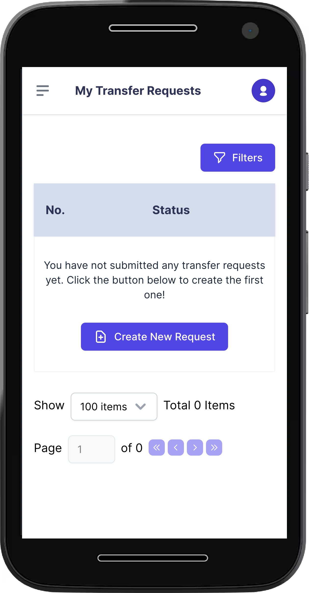
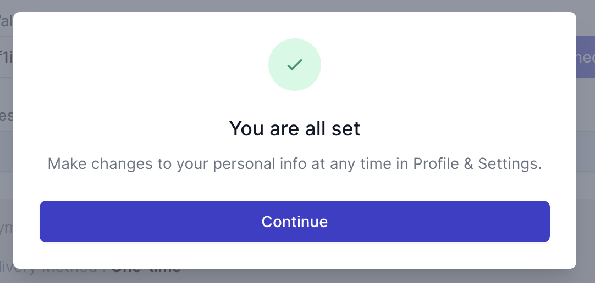
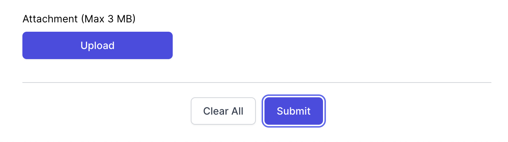
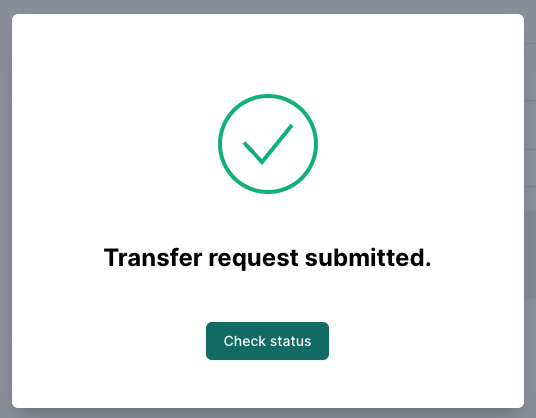

# User

## Table of Contents
- [User](#user)
  - [Table of Contents](#table-of-contents)
  - [Overview](#overview)
  - [Creating an account](#creating-an-account)
  - [Connecting a Wallet](#connecting-a-wallet)
  - [Creating a Transfer Request](#creating-a-transfer-request)

## Overview

This guide is your go-to resource for getting started with our system. As a user, you'll find step-by-step instructions on key actions to kickstart your experience. We've got you covered from the initial login and account setup to creating your first transfer request.

## Creating an account

To start using all the cool features of Emissary, you will first need to create an account. To do it you’ll be required to complete the following steps:

1. Navigate to the Sign In page by clicking "Sign up" at the top right of the landing page.
2. You can choose one of the two options to create your account:  
    a. You can easily sign up using your Google account, eliminating the need for any additional steps. (If the system was configured enabling this option)  
    b. Simply fill out the required fields and activate your account through the email sent by Emissary.

<code> ℹ️ If you participated in an event related to the platform, use the **same registered email address**.</code>

Now you have your new Emissary account!

## Connecting a Wallet

To create transfer requests and receive your tokens you will need first to set up your wallet on Emissary. To do it, complete the steps on [Connecting a Wallet](../guide/connecting-a-wallet.md).

## Creating a Transfer Request

Transfer Requests are the core of Emissary. They are used to request a payment in the different tokens available on the application.

When creating a request for yourself, you’ll be required to complete the following steps:

1. Log in with your account;
2. Navigate to the "My Requests" section;
3. Hit the “Create New Request button”;  
    a. On a desktop, the button is below the My Transfer Requests page title or in the page center if it is your first request.

    TODO: AFTER LOGO/DESIGN UPDATE ADD A SCREENSHOT

    b. On mobile, the button can be found at the center of the page if it is your first request or at the top of the side menu bar after clicking on the Hamburger icon on the top left;

4. Choose the program for which you are requesting tokens;
5. Add a project or **team name as was submitted in the event;**
6. Select a previously added wallet address or add a new one using the same blockchain/network as the program that you are requesting;
7. Add the requested amount;
    1. Notice that programs have different payment methods. Consider it when requesting the amount.

           TODO: AFTER DELIVERY METHOD REMOVAL ADD A SCREENSHOT

8.   Read and check all the terms and conditions so you can go to the next step;
9.   A confirmation must be shown saying that it is all set;

12.  Hit “Continue” to close the popup window, and click "Submit” at the bottom again to create your transfer request.

13.  Congratulations, you have just created your first Transfer Request!

