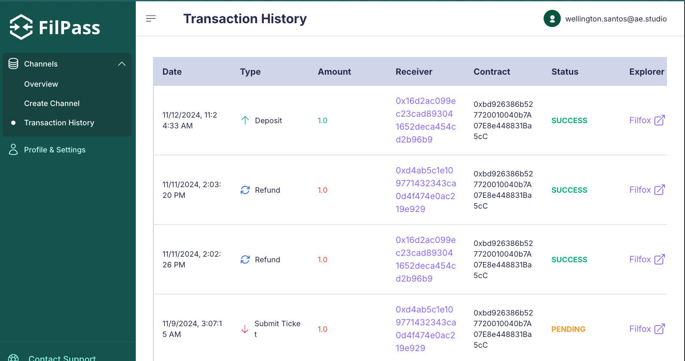

# User

## Table of Contents

- [User](#user)
  - [Table of Contents](#table-of-contents)
  - [Overview](#overview)
  - [Creating an account](#creating-an-account)
  - [Connecting a wallet](#connecting-a-wallet)
    - [Using Fiat On-ramps](#using-fiat-on-ramps)
  - [Deploying a contract](#deploying-a-contract)
  - [Creating a channel](#creating-a-channel)
  - [Top up your credit](#top-up-your-credit)
  - [Creating tickets](#creating-tickets)
  - [Refund your credit](#refund-your-credit)
  - [Checking your transactions](#checking-your-transactions)

## Overview

This guide is your go-to resource for getting started with our system. As a user, you'll find step-by-step instructions on key actions to kickstart your experience. We've got you covered from the initial login and account setup to using your tickets and credits.

## Creating an account

To start using all the cool features of FilPass, you will first need to create an account. To do it you’ll be required to complete the following steps:

1. You can choose one of the two options to create your account:  
    a. You can easily sign up using your Google account, eliminating the need for any additional steps. (If the system was configured enabling this option)  
    b. Simply fill out the required fields on the Sign Up page and activate your account through the email sent by FilPass.

Now you have your new FilPass account!

## Connecting a wallet

To use the credit and ticket functionalities you will need first to set up your wallet on FilPass. To do it, complete the steps on [Connecting a Wallet](../guide/connecting-a-wallet.md).

### Using Fiat On-ramps

If you need to convert traditional fiat currencies (like USD, EUR, etc.) into FIL tokens, you can use fiat on-ramp services. These services allow you to purchase FIL directly using your local currency through various payment methods.

Some popular fiat on-ramp services that support FIL include:
- ChangeNow
- MoonPay
- Ramp Network
- Simplex

Before using any service, make sure to:
1. Verify that the service accepts your preferred payment method
2. Check if the service supports withdrawals to your wallet type (0x or f410 addresses)
3. Compare fees and exchange rates between different services

For more detailed information about fiat on-ramps and supported services, visit the [official Filecoin documentation](https://docs.filecoin.io/basics/assets/get-fil#fiat-on-ramps).

## Deploying a contract

To deploy your own contract on the system you will need to complete the steps on [Deploying a Contract](../guide/deploying-a-contract.md).

## Creating a channel

To start using the system with a specific receiver (Storage Provider), you need to create a channel. Here's how to do it:

1. Navigate to the "Channels" section in your sidebar
2. Click on "Create Channel"
3. Fill in the required information:
   - Your MetaMask Wallet (This information is automatically filled in with your connected wallet)
   - The receiver's wallet address (if using a f410 it will be saved as 0x address)
   - The amount of FIL tokens you want to convert into credit for the channel
4. Click on "Create Channel"
5. Confirm the MetaMask transaction when prompted
6. A success message will be displayed once the transaction is sent
7. Wait for the blockchain transaction to be confirmed. FilPass will automatically monitor the transaction, and once confirmed, the credit will be added to your channel balance.

<code>ℹ️ Note: The FIL tokens will be locked in your deployed contract and can only be used with the specified Storage Provider you have set on the channel. Make sure you enter the correct wallet addresses and amount.</code>

<code>ℹ️ Important: Channel credits have a base 45-day (can be changed) lock period from creation. During this time:
- You can create and use tickets
- The Storage Provider can submit tickets to receive credits
- After the base lock period expires:
  - The Storage Provider can no longer submit tickets
  - You can either refund your remaining credits or top up the channel (where you can extend the lock period)</code>

## Top up your credit

To add more credit to an existing channel, follow these steps:

1. Navigate to the "Channels" section in your sidebar
2. Go to the "Overview" tab
3. Find the channel you want to top up
4. Click on "View Details" button
5. Click on "Top Up" button
6. On the top up page, you'll see:
   - Your MetaMask Wallet (automatically filled and disabled)
   - The receiver's wallet address (automatically filled and disabled)
   - Amount field: Enter the amount of FIL tokens you want to add to your channel in credits
   - Additional ticket days: Select how many more days you want the credit to be valid for submitting tickets
7. Click on "Top Up"
8. Confirm the MetaMask transaction when prompted
9. A success message will be displayed once the transaction is sent
10. Wait for the blockchain transaction to be confirmed. FilPass will automatically monitor the transaction, and once confirmed, the additional credit will be added to your channel balance.

<code>ℹ️ You can only top up your credits for created channels.</code>

## Creating tickets

To create tickets for data retrieval with your Storage Provider, follow these steps:

1. Navigate to the "Channels" section in your sidebar
2. Go to the "Overview" tab
3. Find the channel you want to create tickets for
4. Click on "View Details" button
5. Click on "Create Tickets" button
6. In the modal that appears, enter:
   - Number of tickets: How many tickets you want to create (maximum 500)
   - Credit per ticket: How much credit to allocate to each ticket
7. Click on "Create"
8. Wait for the tickets to be generated. They will appear in your channel's ticket list

Notes:
- The maximum number of tickets you can create per channel is 500. You can create more tickets as soon as you use some of them or they expire.
- The total credit needed (number of tickets × credit per ticket) cannot exceed your available channel credit.
- Tickets can only be used with the Storage Provider specified in the channel.

<code>ℹ️ Check more about tickets specifications [here](../guide/ticket-specifications.md).</code>

## Refund your credit

To refund your remaining credit from a channel, follow these steps:

1. Navigate to the "Channels" section in your sidebar
2. Go to the "Overview" tab
3. Find the channel you want to refund
4. Click on "View Details" button
5. Click on "Refund Credits" button
6. Confirm the MetaMask transaction when prompted
7. A success message will be displayed once the transaction is sent
8. Wait for the blockchain transaction to be confirmed. FilPass will automatically monitor the transaction, and once confirmed, the FIL tokens will be returned to your wallet

<code>ℹ️ Note: You can only refund credits after the lock period has expired and the refund has been started. Any unused tickets will be invalidated after the refund.</code>

## Checking your transactions

To view and monitor your transactions on FilPass, follow these steps:

1. Navigate to the "Transactions" section in your sidebar
2. Here you'll find a comprehensive list of all your transactions, including:
   - Deposits (channel creation and top-ups)
   - Refunds
   - Ticket submissions
3. For each transaction, you can see:
   - Date and time
   - Transaction type
   - Amount involved
   - Receiver wallet
   - Contract address
   - Status (Pending/Confirmed/Failed)
   - Block explorer link

<code>ℹ️ Note: Transactions are automatically updated as they progress through the blockchain. You can also manually refresh the page to see the latest status.</code>

