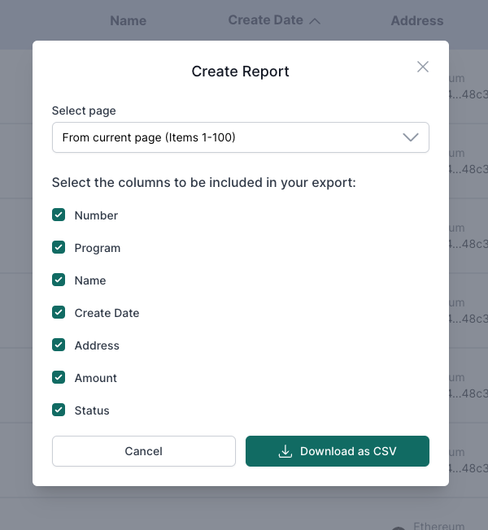

# Viewer

## Table of Contents
- [Viewer](#viewer)
  - [Table of Contents](#table-of-contents)
  - [Overview](#overview)
  - [Checking paid transfer requests](#checking-paid-transfer-requests)
  - [Create a report](#create-a-report)

## Overview

This guide is your go-to resource for getting started with our system. As a viewer, you'll find step-by-step instructions on key actions to kickstart your experience. We've got you covered, from viewing paid transfer requests to generating reports.

## Checking paid transfer requests

As a viewer, you can visualize all the “paid” transfer requests you have been granted access to within the program. To access this information, navigate to the "Paid" page under the My Approvals section. Moreover, the transfer request list offers the option to apply filters based on different fields, enabling you to enhance visualization and streamline your viewing experience.

<code>ℹ️ To know more about filtering transfer requests: [Filtering Transfer Requests](../guide/filtering-transfer-requests.md)</code>

## Create a report

The system allows viewers to generate customized reports for paid requests. This feature enables viewers to selectively include specific rows in the generated reports and define the fields to be included for each row.

To create a report, follow these steps:

1. Log in with your account;
2. Navigate to the "Paid" page under the "My Approvals" section;
3. You can filter the transfer requests that you want to have in the report by clicking on the "Filter" button and applying the filter;
4. On the top right of the page, click on "Create Report";

5. You will see a modal with the information that you want to include on the report, select what you want and click on "Download as CSV"
6. Finally, a CSV file will be downloaded with all your selected information!

