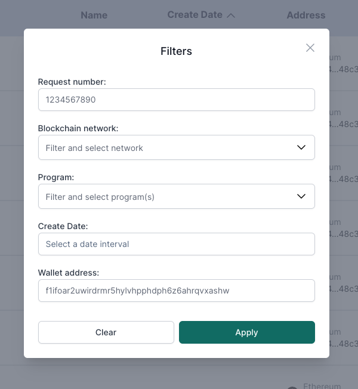

# Filtering Transfer Requests

## Overview

When accessing a page with a transfer request list, users are provided with the option to filter the transfer requests based on various fields. The availability of these fields may vary depending on the user's role and the specific page being accessed.

## Filtering

You can filter the transfer requests by clicking the “Filter” button on the right side of the table.

A modal will be displayed, presenting the available fields for filtering. You can utilize one or more of these fields to obtain more refined and precise results.

